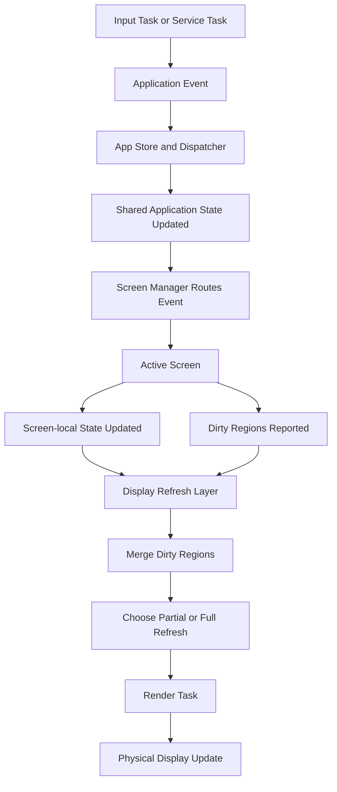

# Architecture Overview

## Purpose

This document describes the intended high-level interaction between the application state, screen manager, individual screens, and the display refresh layer.

The goal is to keep screen additions cheap, keep ownership boundaries clear, and avoid coupling screen logic to e-paper hardware lifecycle details.

Related decisions:

1. [ADR 0001: Screen and Display Ownership Boundaries](decisions/0001-screen-display-ownership.md)
2. [ADR 0002: Screen Transition and Render Invalidation Policy](decisions/0002-screen-transition-render-invalidation.md)

## Design Goals

1. Adding a new screen should not require rewriting core infrastructure.
2. Screen modules should own only screen-specific state and rendering intent.
3. Display refresh behavior should be centralized so partial and full refresh rules stay consistent.
4. Shared application data should remain separate from screen-local UI state.
5. Screen activation and deactivation should be safe over long-term growth.

## Main Layers

### App Store and Dispatcher

The app store owns shared application state.

In this context, shared means the data is owned outside any single screen and survives screen changes. It does not mean every screen must render that data.

Examples:

1. Environment sensor state
2. Time and date
3. Connectivity state
4. Battery state
5. Active mode or navigation state

The dispatcher applies application events to shared state before the active screen derives its render state from that data.

The app store should not own screen-local UI state such as cursor position, local menu selection, or render caches.

Different screens may depend on different shared-state domains without owning them. For example, a home screen may depend on environment data, while a Wi-Fi settings screen may depend on Wi-Fi scan state.

For example, temperature and humidity readings can remain shared application state even if only the home screen, dog-crate screen, or alert-related logic uses them. A Wi-Fi settings screen may ignore those values entirely without changing their ownership.

### Screen Manager

The screen manager owns screen lifecycle and screen routing.

Responsibilities:

1. Track which screen is active
2. Activate and deactivate screens
3. Route events to the active screen
4. Request a full refresh when the active screen changes
5. Keep screen transitions safe and predictable

The screen manager should not assemble screen-specific display data. It should stay generic and treat screens as modules behind an interface.

### Screens

Each screen owns only what it wants to present and the local state needed to present it.

Responsibilities:

1. Define its layout, grid, and render regions
2. Define its local UI state
3. Convert shared application state into screen-specific view state
4. Report which regions became dirty
5. React to routed events in a screen-specific way

Screens should not own:

1. Panel wake and sleep behavior
2. Global display buffers
3. Partial versus full refresh policy
4. Shared application state mutation rules

### Display Refresh Layer

The display refresh layer owns the panel-facing behavior.

Responsibilities:

1. Initialize and maintain the display subsystem
2. Own panel buffers and display transport details
3. Own physical output transforms such as rotation and mirror flipping
4. Decide between partial and full refresh
5. Merge dirty regions when several updates occur together
6. Execute refreshes safely for the e-paper panel
7. Own display sleep and wake decisions at the display subsystem level

The display refresh layer is the only layer that should decide whether multiple dirty regions become one merged update block or whether the screen should receive a full refresh instead.

It also owns the translation from logical screen coordinates to physical panel output. For example, if the device is mounted so the display should be mirrored for viewing in a car's rear-view mirror, that transform belongs in the display refresh layer rather than in individual screens.

## High-Level Event Flow

The intended runtime flow is:

1. An input or service task produces an application event.
2. The dispatcher applies that event to shared application state.
3. The screen manager routes the event and current shared state to the active screen.
4. The active screen updates its local view state and reports invalidated regions.
5. The display refresh layer merges dirty regions and selects partial or full refresh.
6. The render task executes the refresh.

## Rendering Model

The rendering model is based on three kinds of state:

1. Shared application state: global data used by many parts of the app
2. Screen-local state: private UI state used by one screen
3. Refresh plan: generic dirty-region information consumed by the display refresh layer

This split exists to prevent one global display structure from growing to fit every future screen.

Screens operate in logical coordinates. The display refresh layer is responsible for applying any physical output transform before the panel is updated.

## Refresh and Invalidation Rules

The intended rules are:

1. Screens describe what changed.
2. The display refresh layer decides how to update the panel.
3. The first render after a screen activation is always a full refresh.
4. Multiple dirty regions may be merged into one larger partial update when that reduces refresh count.
5. A full refresh may be forced when dirty area, dirty region count, or screen activation makes partial refresh unsafe or inefficient.
6. Physical output transforms such as mirroring or rotation are applied after logical screen layout has been produced.

## Ownership Summary

### Screen owns

1. Screen-local UI state
2. Layout, grid, and named regions
3. Mapping from shared app state to what should be shown
4. Dirty-region reporting

### Screen manager owns

1. Active screen selection
2. Screen lifecycle
3. Event routing to the active screen
4. Full refresh on activation

### Display refresh layer owns

1. Display hardware lifecycle
2. Buffers and refresh transport
3. Physical output transforms such as mirroring and rotation
4. Dirty-region merging
5. Partial versus full refresh policy

### App store and dispatcher own

1. Shared application state
2. Shared event application
3. Global state transitions

## Example: Who Owns What

The following examples show how the ownership model applies in practice.

### Example 1: Home screen temperature update

1. The environment service reads a new temperature value.
2. The app store and dispatcher own the shared environment state update.
3. The screen manager routes the resulting event to the active screen.
4. If the active screen is the home screen, the home screen decides how that temperature should be shown.
5. The home screen marks its temperature region as dirty.
6. The display refresh layer decides whether that change should be a partial update, a merged partial update, or a full refresh.

In this example:

1. The sensor reading itself is not owned by the home screen.
2. The text formatting and layout used by the home screen are owned by the home screen.
3. The refresh strategy is owned by the display refresh layer.

### Example 2: Wi-Fi settings screen does not use environment data

1. The app store may still contain the latest temperature and humidity readings.
2. A Wi-Fi scanning service can run outside the screen and update shared Wi-Fi scan state with available SSIDs.
3. The Wi-Fi settings screen may ignore environment readings completely and use only Wi-Fi-related shared state.
4. That does not change ownership of either the environment data or the Wi-Fi scan results.

In this example:

1. Environment data remains shared application state.
2. Available SSIDs and scan progress belong to shared application state managed outside the screen.
3. The Wi-Fi settings screen owns only its own local UI state, layout, selection state, and rendered content.

### Example 3: Rear-view mirror display mode

1. A screen produces its layout in logical coordinates.
2. The display refresh layer applies the physical output transform needed for mirror viewing.
3. The screen does not reverse text or manually flip coordinates.

In this example:

1. The screen owns what should be shown and where it belongs logically.
2. The display refresh layer owns how that output is transformed before it reaches the panel.

## Non-Goals

This document does not define:

1. Exact C interfaces or header shapes
2. Exact queue topology between tasks
3. Final deep sleep orchestration
4. Final navigation model for overlays or modal screens

Those details can evolve while preserving the ownership boundaries defined here.

## Open Questions

1. Should dirty-region merging happen only within one render cycle or also across queued updates?
2. Will future navigation require overlays, modal screens, or a back stack?
3. Which power-management layer will coordinate deep sleep with display wake and sleep?
4. How much screen-local state should survive screen deactivation?

For decisions already made about ownership and render invalidation, see [ADR 0001: Screen and Display Ownership Boundaries](decisions/0001-screen-display-ownership.md) and [ADR 0002: Screen Transition and Render Invalidation Policy](decisions/0002-screen-transition-render-invalidation.md).
